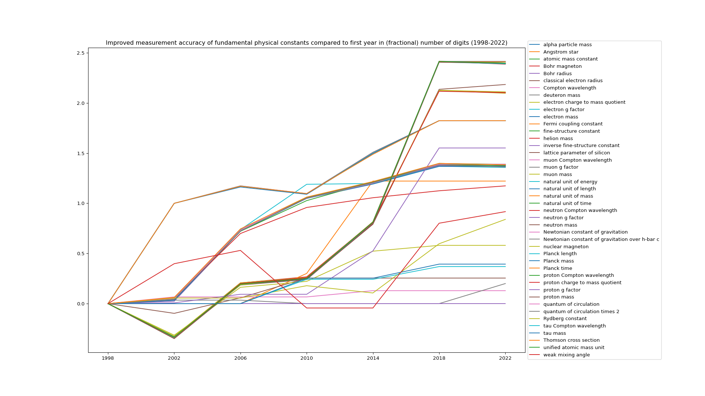

Parses the CODATA fundamental constants ASCII files

obtained from 

- https://pml.nist.gov/cuu/Constants/Table/allascii.txt (current)

- https://physics.nist.gov/cuu/Constants/ArchiveASCII/allascii_1998.txt etc. (historical)

Which seem to have two different formats, until -2006 with parenthesis notation for uncertainty https://physics.nist.gov/cgi-bin/cuu/Info/Constants/definitions.html with and from 2010- onwards with a separate column for these

This is just a quick hack, do not rely on it for accuracy before verifying yourself first!
